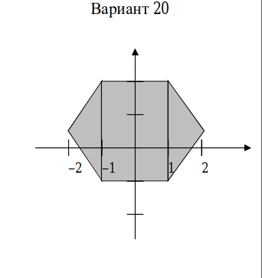

## ЛАБОРАТОРНАЯ РАБОТА «ПРОВЕРКА УСЛОВИЙ» 

Проверить, принадлежит ли точка с заданными координатами (x, y) заштрихованной области. 

### Решение

Фигура состоит из 1 прямоугольника и 2-х равнобедренных треугольнка.

Разобьем фигуру на 3 части и ограничим их области условными выражениями.

Любую входящую точку будем проверять на вхождение в данные в обсласти. Последовательно сравняивая.

#### Левый равнобедренный треугольник LT

Входящие данные: Искомая точка (x, y)
Равнобедренный треугольник с вершинами: A(), B(), C()

Найдем координаты вершины равнобедренного треугольника(B), для этого найдем его гипотенузу и поделим её пополам, отсчитаем от вершины полученное значение.

Точка входящая в область LT должна соответствовать условиям уравнений прямых создающих равонобедренный треугольник:

    `-2 <= x <= -1` && `y = 1.5x + 3.5` && `y = -1.5x -2.5`

#### Правый равнобедренный треугольник RT

Входящие данные: Искомая точка (x, y)
Равнобедренный треугольник с вершинами: A(), B(), C()

Найдем координаты вершины равнобедренного треугольника (B), для этого найдем его гипотенузу, поделим её пополам, отсчитаем от вершины полученное значение.

Точка входящая в область RT должна соответствовать условиям уравнений прямых создающих равонобедренный треугольник:

    `1 <= x <= 2` && `y = 1.5x - 2.5` && `y = -1.5x + 3.5`

#### Центральный прямоугольник CR

Входящие данные:

Точка, входящая в область CR должна удовлетворять условиям

    `-1 <= y <= 2` && `-1 <= x <= 1`

### Реализация

| C | Clojure | C# | F# | Elixir | Elm | Erlang | Go | Kotlin | Mercury | Prolog | Rust |
|:----:|:-:|:-------:|:--:|:--:|:------:|:---:|:------:|:--:|:------:|:-------:|:------:|
| [main.c](c/main.c) |   |   |   |   |   |   |   |   |   |   |   |   |